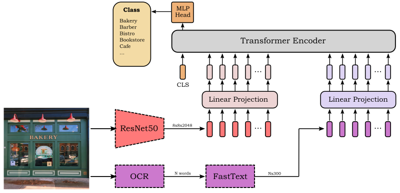

# ConTextTransformer

A simple multi-modal Transformer model for fine-grained image classification on the [Con-Text dataset](https://staff.fnwi.uva.nl/s.karaoglu/datasetWeb/Dataset.html).

Using scene text (when available) provides high-level semantic information that is useful for the task.

In the ConTextTransformer we first use three pre-trained models for feature extraction: a ResNet50, an OCR, and the FastText word embedding. Then we project the visual (ResNet) and textual (FastText) features to a common dimensionality (Linear Projections) and we feed them into the Tansformer Encoder. Finally, the MLP head takes the output feature of the CLS token and predicts one of the classes with Softmax.

